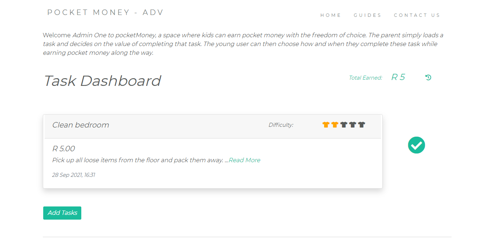

<div id="top"></div>

# Pocket Money - ADV

Welcome to "Pocket Money - ADV", an Express.js web application with the intent to demonstrate a basic end-to-end workflow as a portfolio project. This practical web application is built with Node.js, Express, and MongoDB. The application uses a minimalistic UI/UX design as a blank canvas to record, view, and manage household chores linked to a user account.

 
## Table of contents

----

- [Overview](#overview)
  - [Features](#screenshot)
  - [First Look](#screenshot)
  - [Links](#links)
- [My process](#my-process)
  - [Built with](#built-with)
- [Setup guide](#quick-start)
  - [Prerequisites](#prerequisites)
  - [Project setup](#setup-guide)
  - [Useful resources](#useful-resources)
- [Roadmap](#roadmap)
- [Author](#author)

----


## Overview

This demonstration application can scale to show as much or little detail as we need, and can be used to show off almost any Express feature. More importantly, it allows us to store and retrieve application data using a fully-managed cloud database developed by the same people that build MongoDB. MongoDB Atlas offers a great noSQL solution to handling the application's JSON-like documents and data schemas.

The diagram below shows the main flow of data and components that are implemented when handling the HTTP request/response. 

<br>
<br>


Image source: [Mozille tutorials](https://developer.mozilla.org/)

<br>
<br>

### Features:

This feature list showcase basic functionality with responsive UI components. The web application in its current state offers limited features and is intended as an MVP. This version may be a useful starting point for some users.


| Functions              | Detail                                            | URL                         |
| ---------------------- | ------------------------------------------------- | --------------------------- |
| Sign up for an account | User can sign up an account by inputting username, email and password | /users/register |
| Log in with username | User can log in using registered username and password | /users/login |
| Reset password | User can reset account password | /users/reset |
| Log out | User can log out of account | /users/logout |
| View all chores | 1. User can view chore list with description, difficulty rating, associated rewards and date of entry<br>2. User can keep track of financial rewards for completing chores after login | /catalog/ |
| View a chore | User can view chore, description, date created, and detail of a chore after login | /catalog/view/post/:id |
| Create a chore | User can add a chore with detail after login | /catalog/post/compose |   
| Complete a chore | User can indicate when a chore is complete to claim the associated financial reward after login | /catalog/post/:id |
| Task/Chore History | User can view completed chores and settle outstanding financial rewards | /catalog/summary |

<p align="right">(<a href="#top">back to top</a>)</p>


### First Look:

<br>

Task Dashboard  

 


### Links:

- Live Site URL: [Coming Soon]()

<p align="right">(<a href="#top">back to top</a>)</p>


----


## My process

### Built with:

- Semantic HTML5 markup
- CSS custom properties
- Javascript
- [Express.js](https://expressjs.com/)
- [EJS](https://ejs.co/#install)
- [Bootstrap](https://getbootstrap.com/)
- [GIT](https://git-scm.com/) - for version control


**Note:** A range of external libraries were used in this project. View dependancies in the package.json file for more information.

<p align="right">(<a href="#top">back to top</a>)</p>


----


## Setup guide

### Prerequisites:

- [npm](https://www.npmjs.com/get-npm)
- [Node.js](https://nodejs.org/en/download/)
- [mongoDB](https://mongodb.com/)

<br>

To get this project up and running locally on your computer:

1. Set up a [Node.js](https://wiki.developer.mozilla.org/en-US/docs/Learn/Server-side/Express_Nodejs/development_environment) development environment.
2. Download and install [npm](https://www.npmjs.com/get-npm).
3. Install [mongoDB](https://docs.mongodb.com/manual/installation/) locally.
4. Navigate to the main page of this repository and clone or download the project files. 
5. Set up and run project.

<br>

> **Note:** The demonstration web application uses a default MongoDb database hosted on [MongoDB Atlas](https://www.mongodb.com/cloud/atlas). Install MongoDB locally or sign up for an account to run your own code experiments.

<br>

### Project setup:

**1. Install project dependancies:**
  ```sh
  npm install
  ```
**2. Store environmental variables in `.env` file and save:**
  ```
  //If using MongoDB Atlas, be sure to include your API key in the .env file.
  SESSION_SECRET=<YOUR_OWN_SECRET_PHRASE>
  API_KEY_MONGO=<YOUR_API_KEY>
  PORT=3000
  NODE_ENV=development
  ```
**3. Uncomment / comment out the relevant lines in the `app.js` file:**

Running mongoDB locally:
  ```js
  //Set connection to mongoDB using localhost:27017
  mongoose.connect("mongodb://localhost:27017/<your-db-name>", {useNewUrlParser: true, useUnifiedTopology: true});

  ``` 
Mongo Atlas:
  ```js
  // Set up mongoose connection with url to externalhost
  const dev_db_url = 'mongodb+srv://'+process.env.API_KEY_MONGO+'?retryWrites=true&w=majority';
  const mongoDB = process.env.MONGODB_URI || dev_db_url;
  mongoose.connect(mongoDB, {useNewUrlParser: true, useUnifiedTopology: true});

  ```
**4. Server start:**
  ```sh
  DEBUG=pocketmoneyadv:* npm run devstart  //Linux / macOS

  SET DEBUG=pocketmoneyadv:* & npm start  //Windows Command Prompt / PowerShell

  ```
**5. Open a browser to http://localhost:3000/ to open the site.**

<br>

### Useful resources

- [Mozilla tutorial home page](https://github.com/mdn/express-locallibrary-tutorial) - This tutorial can help to understand more advanced HTTP request/response concepts using Middleware, Routing and Controllers.
- [The Complete Web Development Bootcamp - Dr Angela Yu](https://www.udemy.com/course/the-complete-web-development-bootcamp/) - This is an amazing course which helps with fundemental web development skills and understanding a broad range of tools and technologies. For anyone interested in learning about full stack web development, this is one of the highest rated web development courses on Udemy.

<p align="right">(<a href="#top">back to top</a>)</p>


----


## Roadmap

1. Features:
    - Goal Tracker
    - Recurring task scheduling and date handler
    - Dark mode
    - Reward type selector
    - Sort function for Task list and history
2. Testing:
    - Unit Testing modules
3. Style:
    - UI/UX redesign
    - SCSS
4. Performance:
    - Optimisation
    - Bux fixes

See the [open issues]() for a full list of proposed features (and known issues).

<p align="right">(<a href="#top">back to top</a>)</p>


## Author

- Website - [Coming Soon]()
- Developer - [Shaun Bristow]()

